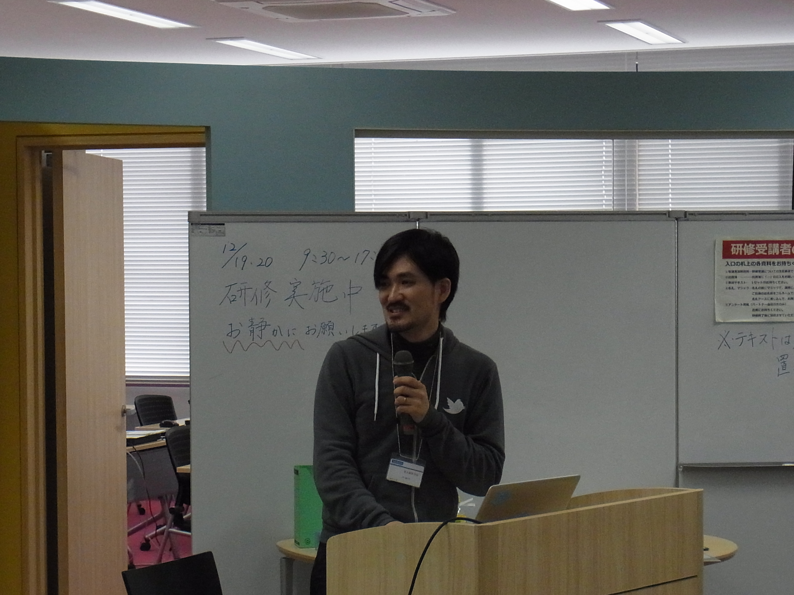
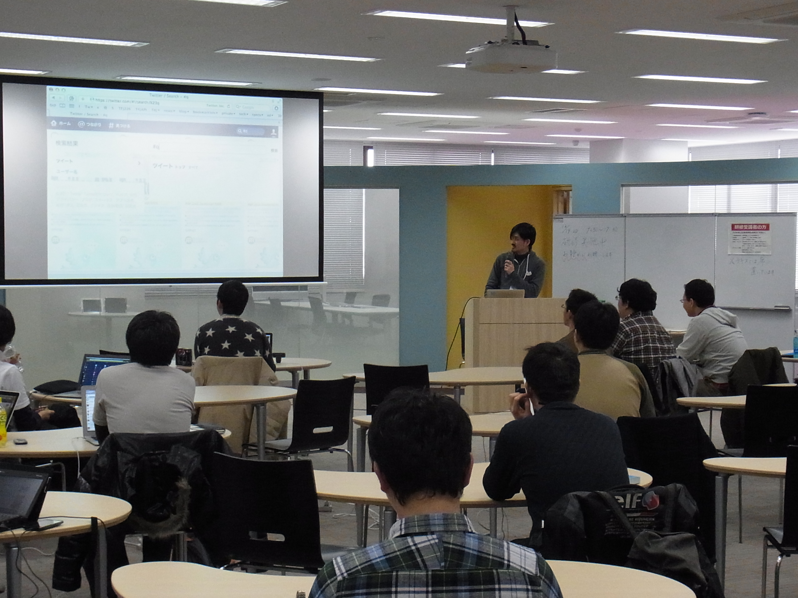
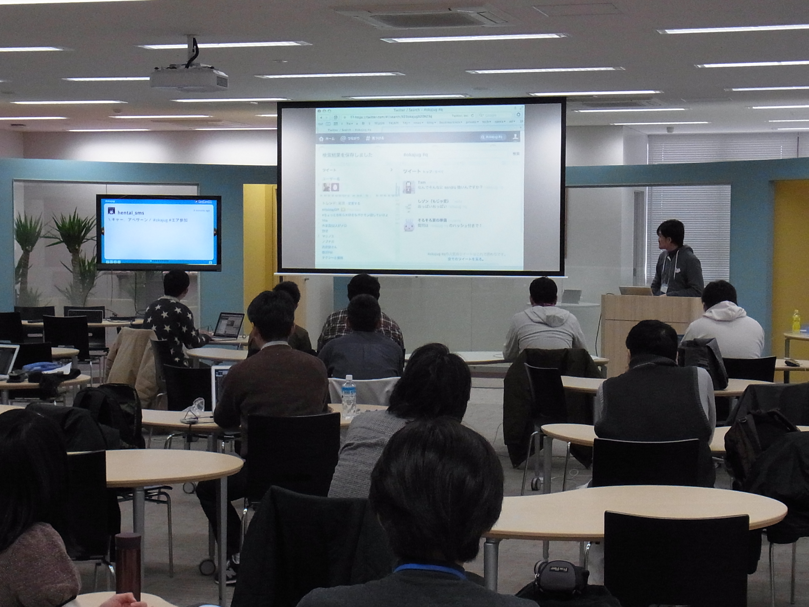
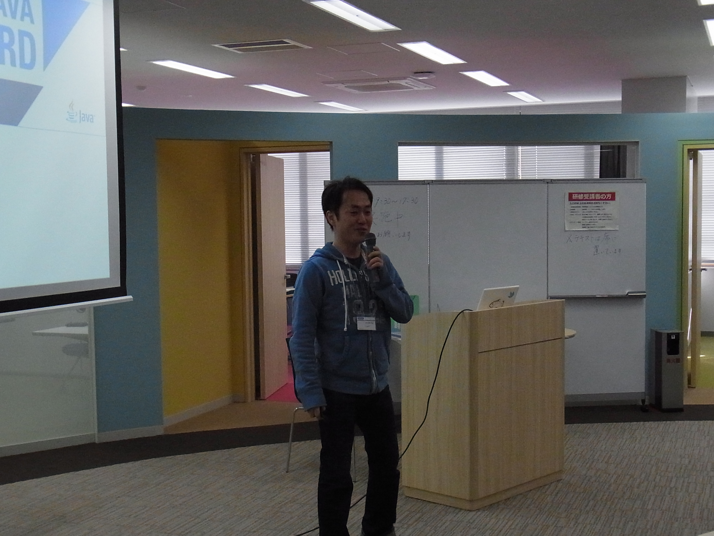
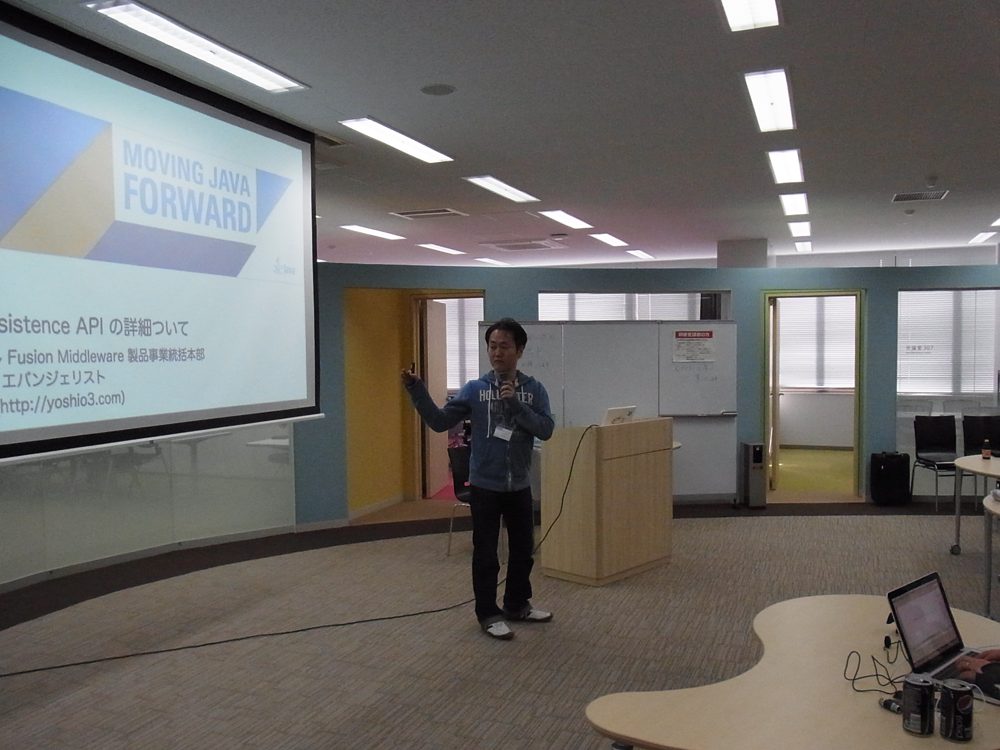
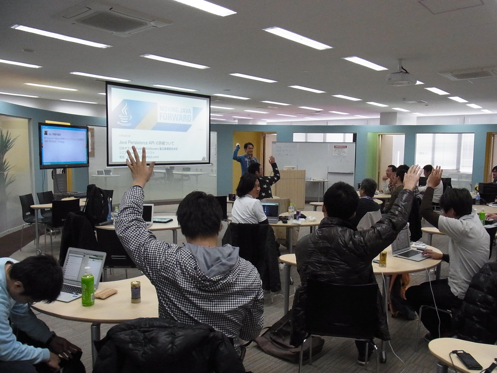
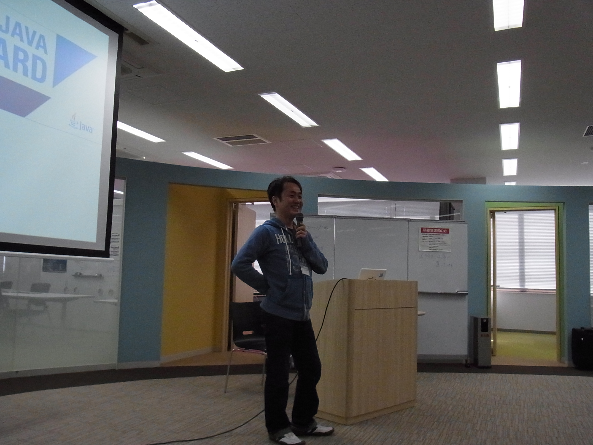
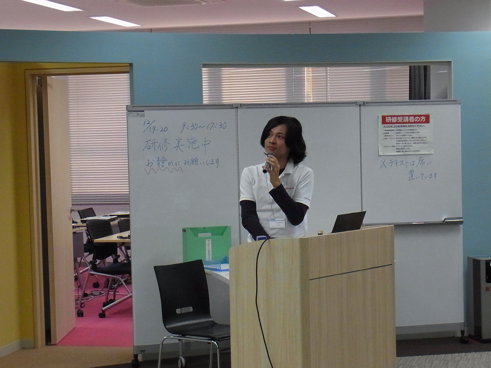
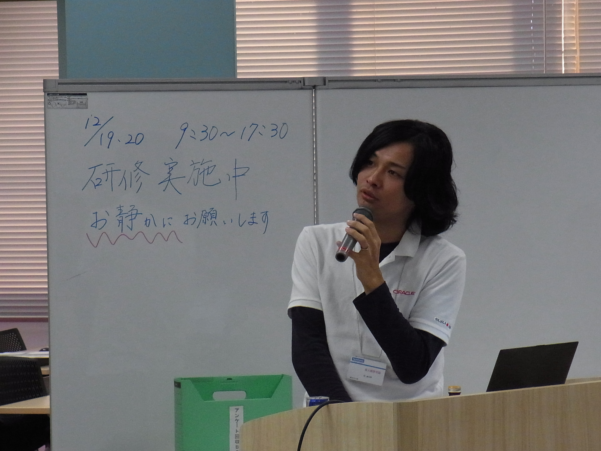

.. title:: 第１回　岡山Javaユーザ会勉強会　報告
.. _study01:

第１回　岡山Javaユーザ会勉強会　報告
======================================
2011/12/17に、記念すべき第１回　岡山Javaユーザ会の勉強会を開催しました。

* 日時　2011/12/17 13:30〜17:00
* 場所　株式会社シンフォーム
* 参加費　無料
* 参加人数　51人
* Togetter http://togetter.com/li/229044

今こそオープンソースが熱いJava
--------------------------------
* 登壇者　オープンソースデベロッパ　山本裕介氏

* セッションの様子

* セッション資料

.. raw:: html

    

    <strong style="display:block;margin:12px 0 4px">
        <a href="http://www.slideshare.net/yusukey/ss-10620853" title="今熱いオープンソース" target="_blank">今熱いオープンソース</a>
    </strong>
    <iframe src="http://www.slideshare.net/slideshow/embed_code/10620853" width="425" height="355" frameborder="0" marginwidth="0" marginheight="0" scrolling="no"></iframe>
    
 View more <a href="http://www.slideshare.net/" target="_blank">presentations</a> from <a href="http://www.slideshare.net/yusukey" target="_blank">Yusuke Yamamoto</a> 
 

Java Persistence APIの詳細について
------------------------------------
* 登壇者　日本Oracle株式会社　シニアJavaエバンジェリスト 寺田佳央氏

* セッションの様子

   
* セッション資料

.. raw:: html

    
 <strong style="display:block;margin:12px 0 4px"><a href="http://www.slideshare.net/OracleMiddleJP/the-detail-of-jpa-20" title="The detail of JPA 20" target="_blank">The detail of JPA 20</a></strong> <iframe src="http://www.slideshare.net/slideshow/embed_code/10621207?rel=0" width="425" height="355" frameborder="0" marginwidth="0" marginheight="0" scrolling="no"></iframe> 
 View more presentations from <a href="http://www.slideshare.net/OracleMiddleJP" target="_blank">Oracle Fusion Middleware</a> 
 

このwarをデプロイしたのは誰だあっ！！～至高のCI Jenkins～
-----------------------------------------------------------
* 登壇者　岡山Javaユーザ会　角田裕樹氏

* セッションの様子

   
* セッション資料

http://dl.dropbox.com/u/15625994/okajug_01/index.html

総括
-----------------------------
第１回の岡山Javaユーザ会勉強会、５０名を超える参加人数で、初めての勉強会としては大成功に終わることができました。

山本さんは、某社でトップエンジニアとして活躍されるまでの自身のキャリアを、時にユーモアを交えながら話していただきました。きっと参加者の皆さんのキャリア形成について、大きなヒントになったのではないかと思います。

寺田さんには、JPAについて詳細を話していただきました。これからのJavaEEの可能性を感じさせる内容であったのではないでしょうか。

角田さんには、今の開発現場において必須ツールとなりつつあるCIツールの代表格であるJenkinsについて紹介していただきました。

また、勉強会後の懇親会は忘年会議2011に合流し、こちらも多数の参加者で盛り上がりました。

LT大会では、ここではちょっと言えないような（！）暴露LTがあったりと、大変な盛況。2011年を締めくくるに相応しい、盛りだくさんな内容でした。

改めまして、参加者の皆様、また遠いところお越しくださいました山本さん、寺田さん両名に感謝いたします。ありがとうございます！

次回の勉強会は2012/2月の開催を予定しています。こちらも是非ご参加ください。
