.. title:: 第２回　岡山Javaユーザ会勉強会　報告
.. _study02:

第２回　岡山Javaユーザ会勉強会　報告
======================================
2012/2/25に、第２回　岡山Javaユーザ会の勉強会を開催しました。

* 日時　2012/2/25 13:30〜17:00
* 場所　岡山県立図書館
* 参加費　\500
* 参加人数　36人
* Togetter http://togetter.com/li/263361

RedBullによるエナジーチャージタイム
--------------------------------
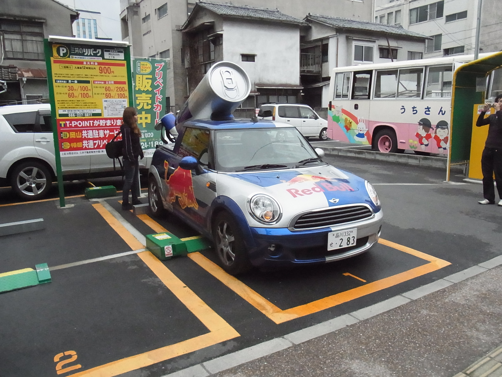
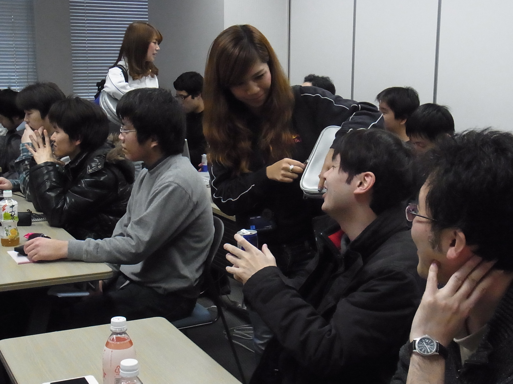
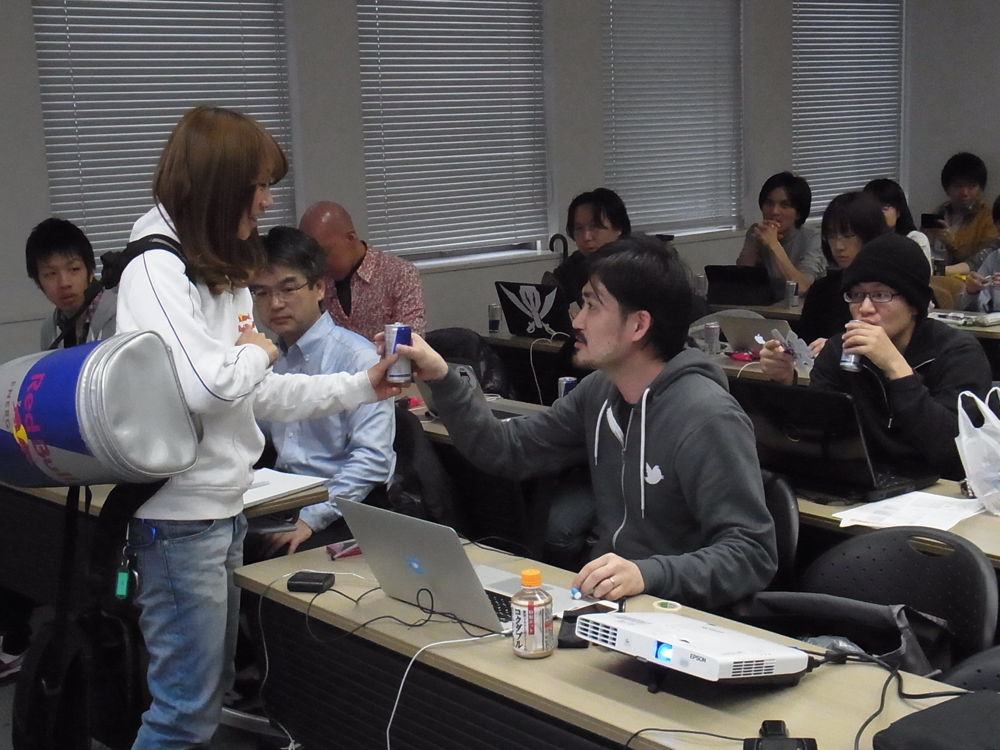

JRubyで作るAPIサーバー
--------------------------------
* 登壇者　岡山Ruby/Ruby on Rails勉強会　山本和久氏(@kazuhisa1976)

* セッションの様子

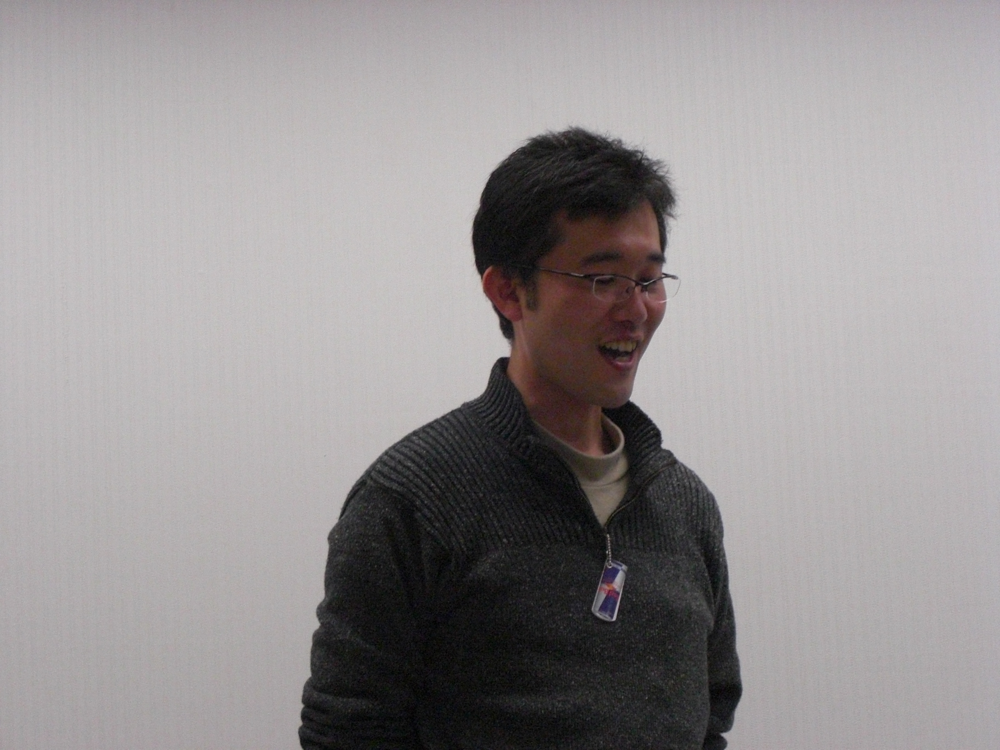
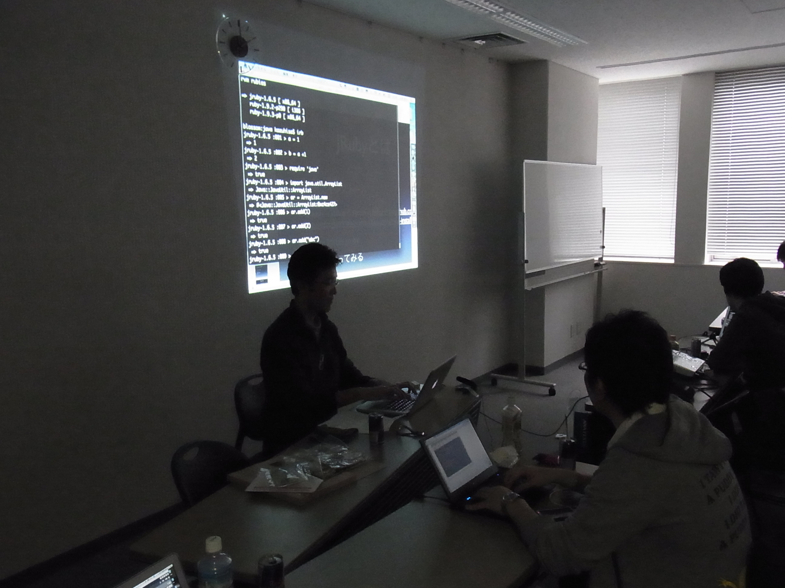

* セッション資料

.. raw:: html

	
 <strong style="display:block;margin:12px 0 4px"><a href="http://www.slideshare.net/kazuhisa01/j-rubyapi" title="JRubyで作るapiサーバー" target="_blank">JRubyで作るapiサーバー</a></strong> <iframe src="http://www.slideshare.net/slideshow/embed_code/11754791" width="425" height="355" frameborder="0" marginwidth="0" marginheight="0" scrolling="no"></iframe> 
 View more <a href="http://www.slideshare.net/" target="_blank">presentations</a> from <a href="http://www.slideshare.net/kazuhisa01" target="_blank">kazuhisa01</a> 
 

LT:アンドロイド開発初心者のためのライフサイクルのはなし
------------------------------------------------
* 登壇者　深井貴明氏(@pukka_TIM)

* セッションの様子

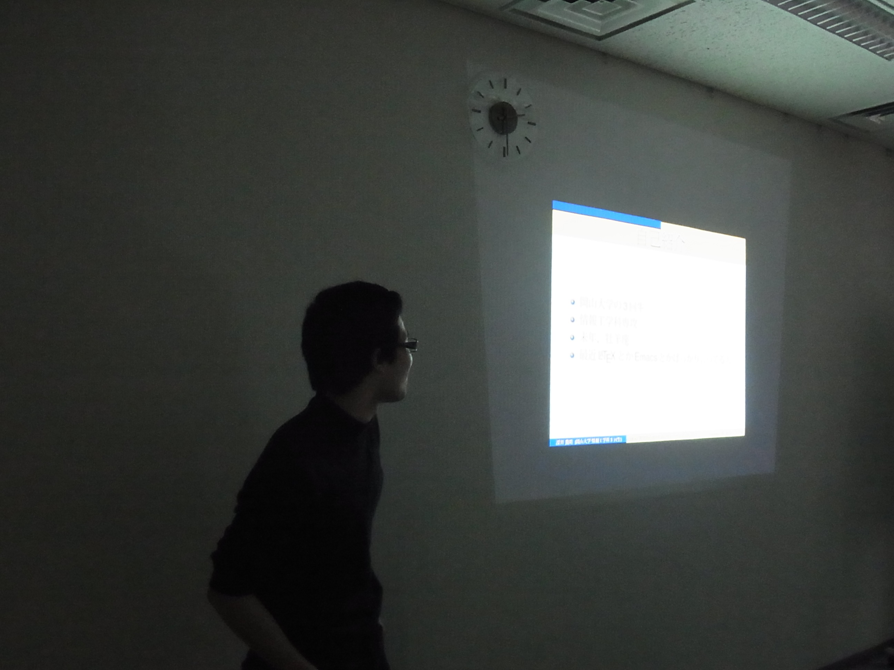
   
* セッション資料
	http://tokikane.syogyoumujou.com/contents/okajug2LT.pdf

JavaFXで開く新世代GUI
--------------------------------
* 登壇者　Java in the Box　櫻葉祐一氏(@skrb)

* セッションの様子

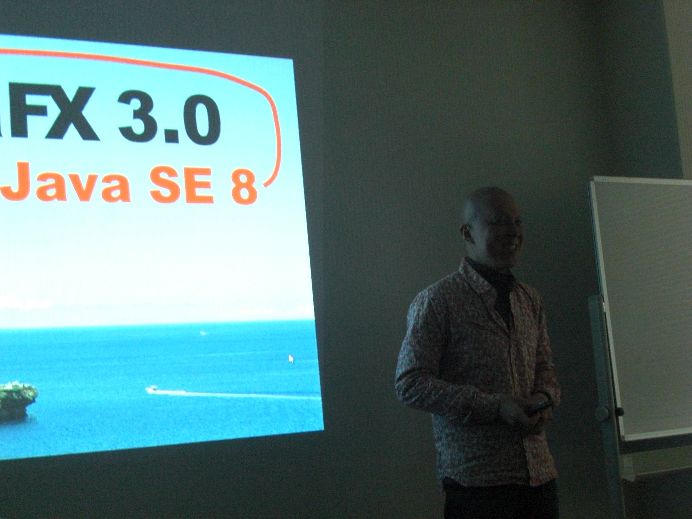
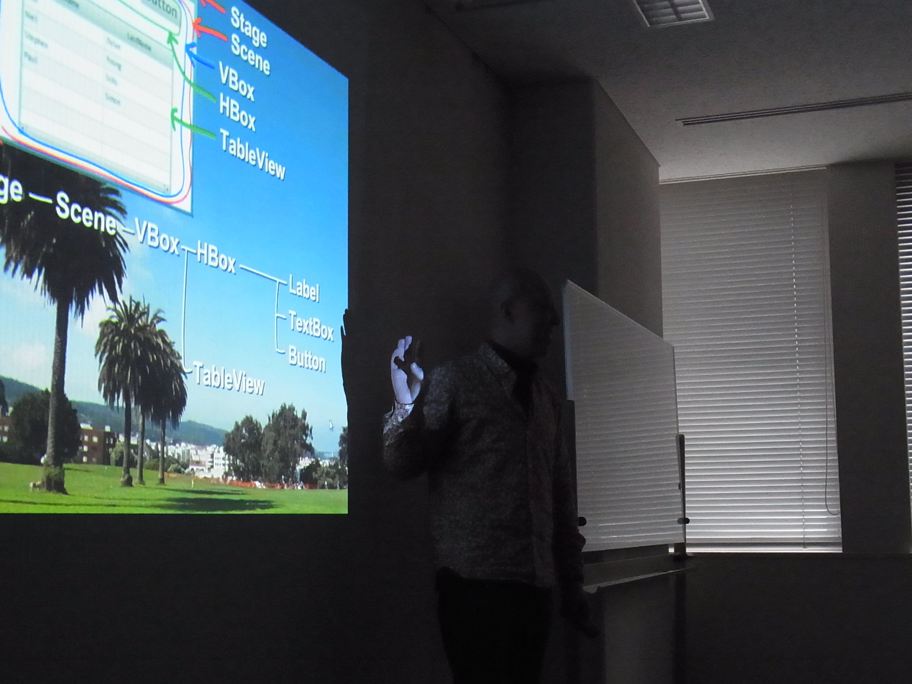

* セッション資料

.. raw:: html

	
 <strong style="display:block;margin:12px 0 4px"><a href="http://www.slideshare.net/skrb/javafxgui" title="JavaFXで開く新世代GUI" target="_blank">JavaFXで開く新世代GUI</a></strong> <iframe src="http://www.slideshare.net/slideshow/embed_code/11767308" width="425" height="355" frameborder="0" marginwidth="0" marginheight="0" scrolling="no"></iframe> 
 View more <a href="http://www.slideshare.net/" target="_blank">presentations</a> from <a href="http://www.slideshare.net/skrb" target="_blank">skrb</a> 
 

LT:はじめてのKotlin
--------------------------------
* 登壇者　関西Javaエンジニアの会　谷本心氏(@cero_t)

* セッションの様子

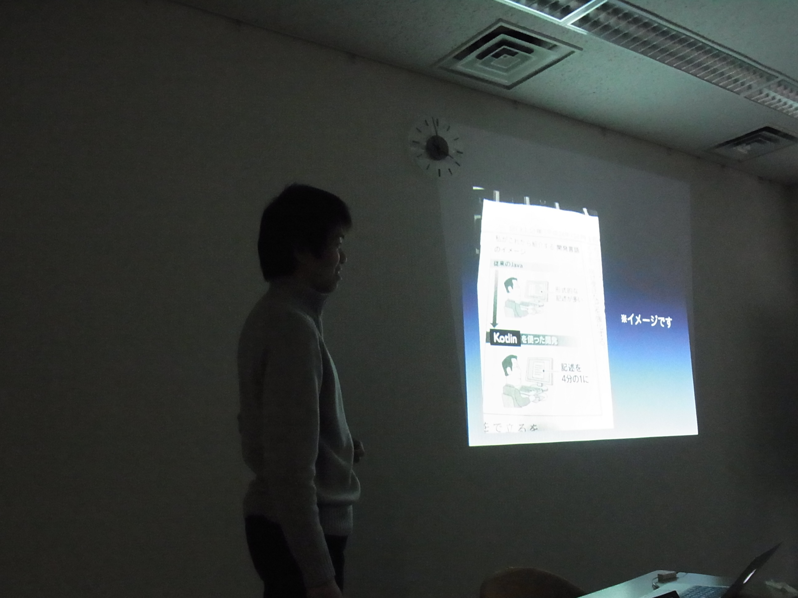
.. image:: okajug/static/study02/photo04-02.JPG
   :width: 50%  
   

Java7再入門講座
--------------------------------
* 登壇者　岡山Javaユーザ会　吉田貴文(@zephiransas)

* セッションの様子

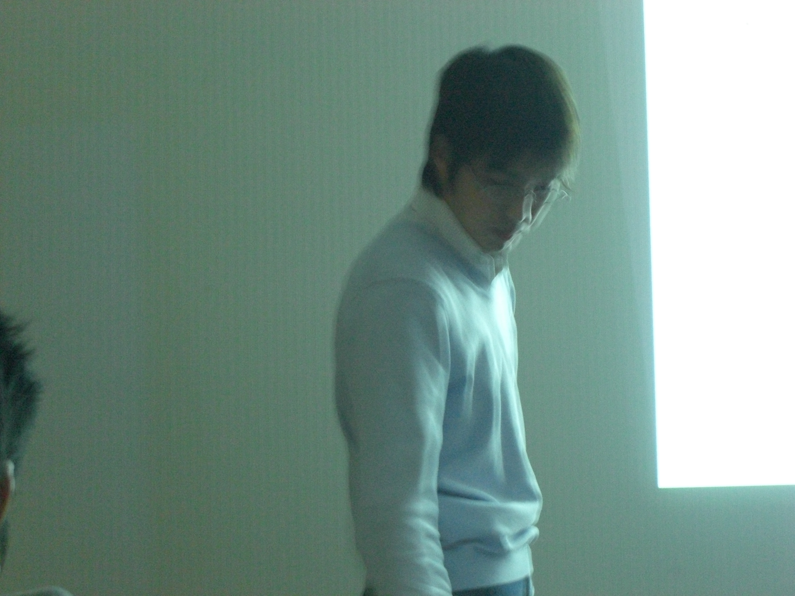
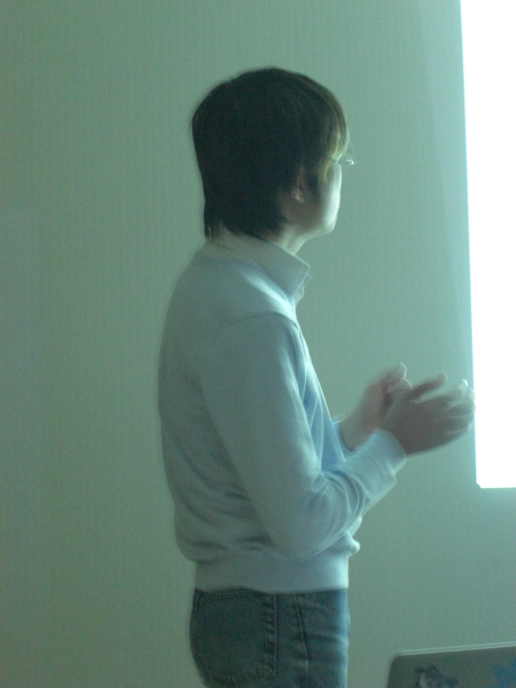

* セッション資料

.. raw:: html

	
 <strong style="display:block;margin:12px 0 4px"><a href="http://www.slideshare.net/zephiransas/java7-11754853" title="Java7再入門講座" target="_blank">Java7再入門講座</a></strong> <iframe src="http://www.slideshare.net/slideshow/embed_code/11754853" width="425" height="355" frameborder="0" marginwidth="0" marginheight="0" scrolling="no"></iframe> 
 View more <a href="http://www.slideshare.net/" target="_blank">presentations</a> from <a href="http://www.slideshare.net/zephiransas" target="_blank">takafumi Yoshida</a> 
 

総括
-----------------------------
第２回岡山Javaユーザ会勉強会も36人と多数のかたにご参加いただきました。

その中でも隠れた目玉！RedBullによるエナジーチャージタイム！今回特別にRedBull社にご協力いただき、開発現場で奮闘するエンジニアの強い味方、RedBullを持参していただき、参加者の皆さんにエナジーチャージをおこなっていただきました！
遠いところ来て頂きました、RedBullガールのお二人、本当にありがとうございました！

最初のセッションは岡山Ruby/Ruby on Rails勉強会の山本氏による、JRubyで作るAPI講座のセッションです。静的型付けのJavaとは一見、真反対の動的言語Rubyを使用して、両者のいいとこ取りをするというアプローチに
参加者の皆さんも興味津々だったようです。サーバにはGlassFishを使用していますよ！

また、深井氏にはLTとしてAndroidのライフサイクルの話をしていただきました。次はちゃんと準備しような！w

そして櫻葉さんはJavaFXのセッション。音と映像を駆使したセッションは、すべてJavaFXで書かれているとのこと！圧倒的臨場感で、きっとJavaFXの世界を身近に感じることができたと思います。

関西Javaの谷本さんには、まだ最近発表されたばかりのKotlinのLTをおこなっていただきました。Java7で導入されたDynamicInvokeと含めて、今後様々な言語の実行プラットフォームとして進化するJVMの可能性を感じるLTでした！

吉田は今回はJava7のProject CoinとNIO.2について、少しだけ詳細なお話をさせていただきました。今回のセッションが皆様のJava7への入り口になってくれれば幸いです。

次回の勉強会は４月の開催を予定しています。
同月に開催されるJavaOneに、私を始め岡山Javaユーザ会の運営スタッフも参加しますので、JavaOneの報告会として開催する予定になっています。
こちらも是非、ご参加ください。