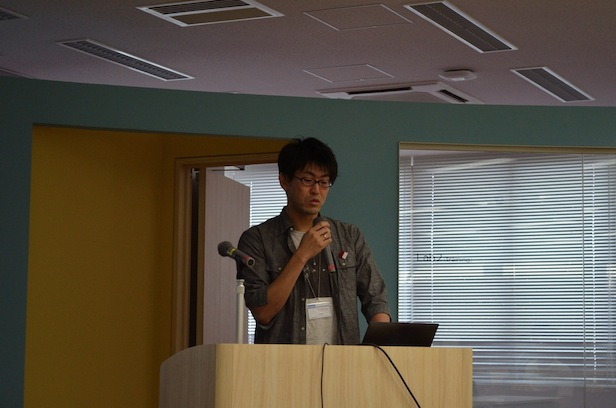
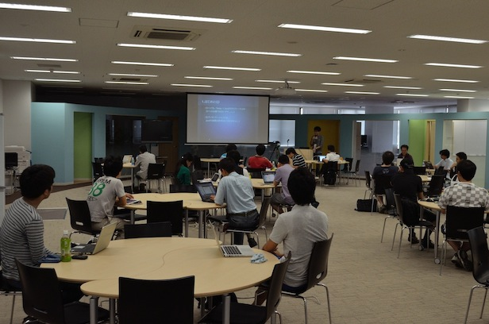
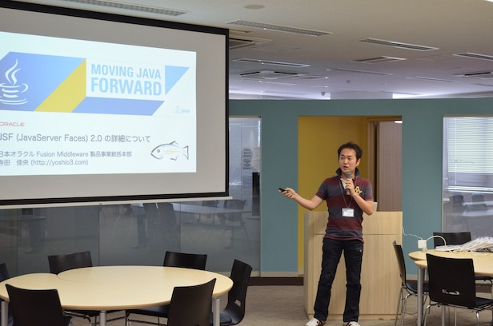
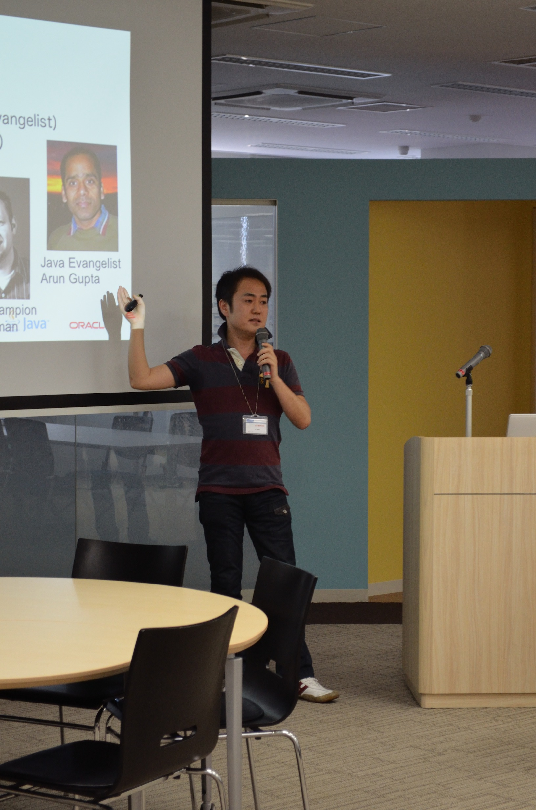
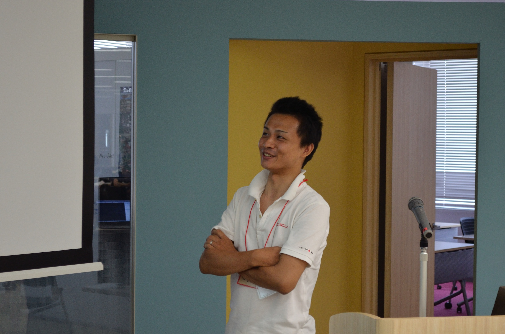
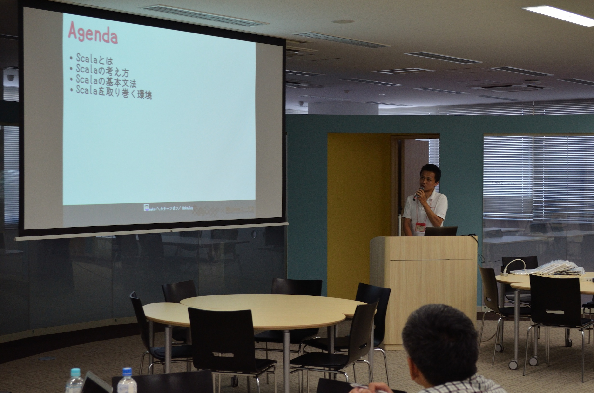
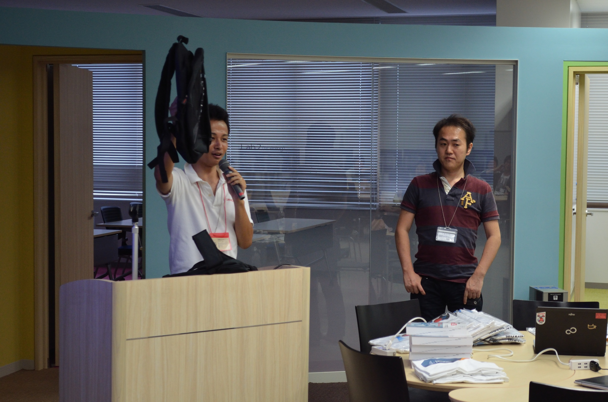
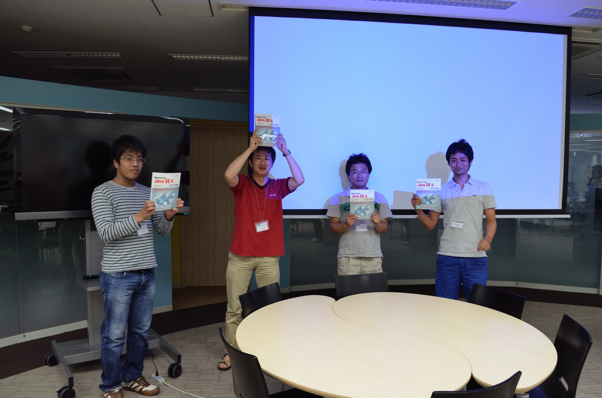
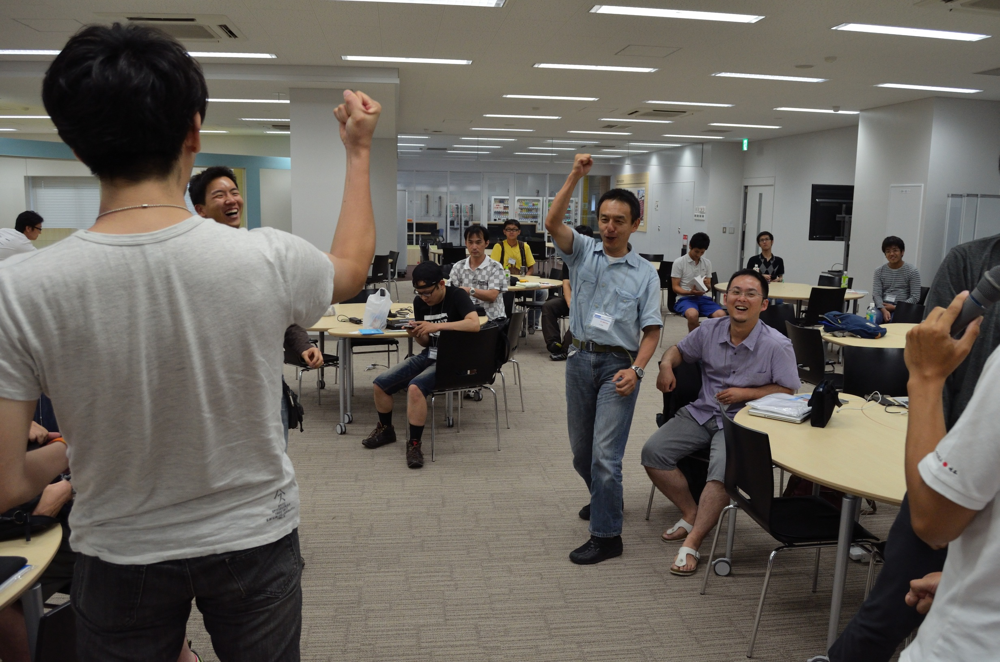

.. title:: 第３回　岡山Javaユーザ会勉強会　報告
.. _study03:

第３回　岡山Javaユーザ会勉強会　報告
======================================
2012/7/28に、第３回　岡山Javaユーザ会の勉強会を開催しました。

* 日時　2012/7/28 13:30〜17:20
* 場所　株式会社シンフォーム
* 参加費　無料
* 参加人数　31人
* Togetter http://togetter.com/li/346184
* 会場の様子 http://www.flickr.com/photos/zephiransas/sets/72157630804049912/

はじめよう JavaFX 2.x
--------------------------------
* 登壇者　a_know氏(@a_know)

* セッションの様子

GlassFishの監視ツール、LightFishの紹介
------------------------------------------------
* 登壇者　岡山Javaユーザ会　吉田貴文(@zephiransas)

* セッション資料

.. raw:: html

	<iframe src="http://www.slideshare.net/slideshow/embed_code/13797550" width="427" height="356" frameborder="0" marginwidth="0" marginheight="0" scrolling="no" style="border:1px solid #CCC;border-width:1px 1px 0;margin-bottom:5px" allowfullscreen> </iframe> 
 <strong> <a href="http://www.slideshare.net/zephiransas/lightfish" title="Lightfish触ってみた" target="_blank">Lightfish触ってみた</a> </strong> from <strong><a href="http://www.slideshare.net/zephiransas" target="_blank">takafumi Yoshida</a></strong> 

JSF (JavaServer Faces) 2.0 の詳細について
----------------------------------------------------
* 登壇者　日本Oracle株式会社　シニアJavaエヴァンジェリスト　寺田佳央氏(@yoshioterada)

* セッションの様子

* セッション資料

※8月下旬公開予定です
   

ジャバ語の次はスカラ語
--------------------------------
* 登壇者　天領倉敷Scala/岡山Javaユーザ会　角田裕樹氏(@razon)

* セッションの様子

* セッション資料

http://shizone.github.com/slides/okajug_03/#0

プレゼント争奪じゃんけん大会
------------------------------------------

総括
-----------------------------
第３回岡山Javaユーザ会勉強会も30人を超える多数の方にご参加いただきました。ありがとうございます。

今回も第１回と同じく、OracleのJavaエヴァンジェリスト寺田氏をお招きし、JavaFX、JavaEE、Scalaと幅広い話題で勉強会を行うことができました。

a_know氏には自身で作られたSwingアプリをJavaFXにマイグレーションした経験を元に、JavaFXについて広範囲に話をしていただきました。JavaFXはこれからのJavaのGUIを支える中心となるテクノロジーです。この機会にしっかりと押さえておきたいですね。

吉田からは、先日発表されたばかりのLightFishをご紹介させていただきました。LightFishはJavaFXのサンプルとしても優れていますので、これを参考にJavaFXの勉強をはじめるのもいいかもしれません。またJavaEEの参照実装であるGlassFishも合わせてご検討いただければ、より簡単になったJavaEEの開発を体感していただけると思います。

Oracle寺田氏にはJavaEEのテクノロジーの１つ、JSFについてお話をして頂きました。デモを見せていただきましたが、その中でも特に興味深いと思ったのはAjax対応。通常のPOSTして検索結果を表示する画面が、たったの1行でAjax対応して、リロードなしで検索結果が見えるような仕組みをデモしていただきました。
また、8月にはアメリカからJavaEEのエキスパートを招いてのセミナーがあるそうです。近日中にエントリが始まるようですが、日本にいる場合では簡単に聞けない内容ですので、こちらも合わせて参加したいですね。

角田氏には、（いつものように）Scalaの話をしていただきました。概念だけだと入ってこない部分もあるとおもうので、そんな時には是非、天領倉敷Scala勉強会にも参加してみてください。

次回の勉強会は9〜10月の開催を予定しています。お楽しみに。