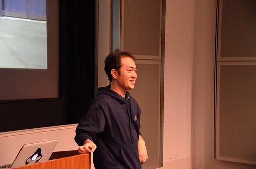
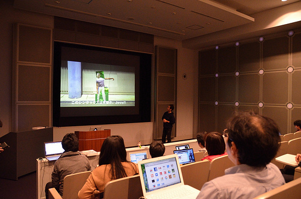
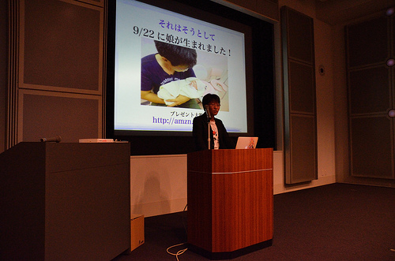
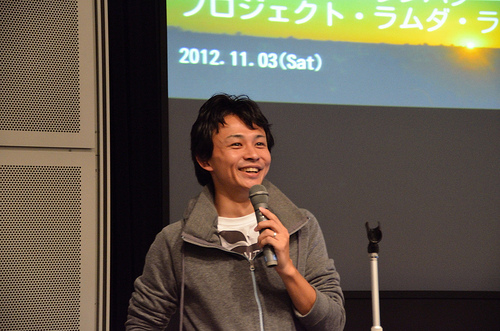
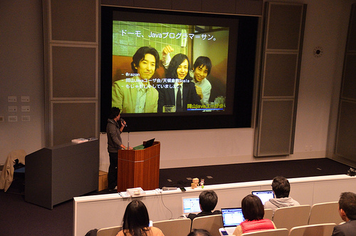
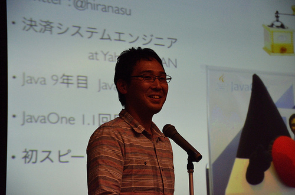
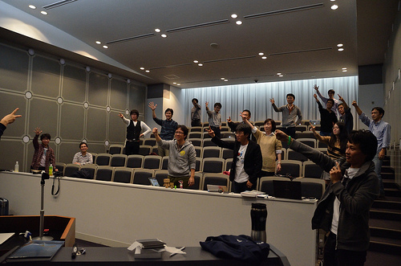

.. title:: 第４回　岡山Javaユーザ会勉強会　報告
.. _study04:

第４回　岡山Javaユーザ会勉強会　報告
======================================
2012/11/3に、第４回　岡山Javaユーザ会の勉強会を開催しました。

* 日時　2012/11/3 13:00〜17:00
* 場所　岡山県立図書館　デジタル情報シアター
* 参加費　¥500
* 参加人数　25人
* Togetter http://togetter.com/li/401022
* 会場の様子 http://www.flickr.com/photos/zephiransas/sets/72157631924117927/

JavaOne 2012 サンフランシスコ・最新アップデート
---------------------------------------------
* 登壇者　日本Oracle株式会社　シニアJavaエヴァンジェリスト　寺田佳央氏(@yoshioterada)

* セッションの様子

LT:github shopのグッズ、共同購入の告知
------------------------------------------------
* 登壇者　岡山Javaユーザ会　@ryosms 氏

* セッションの様子

プロジェクト・ラムダ・ライジング
----------------------------------------------------
* 登壇者　天領倉敷Scala/岡山Javaユーザ会　角田裕樹氏(@razon)

* セッションの様子

LT:Twitterで振り返る、JavaOne2012 San Francisco
------------------------------------------------
* 登壇者　@hiranasu 氏

* セッションの様子

プレゼント争奪じゃんけん大会
------------------------------------------

